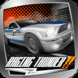

<p align="center">
  
</p>

<h1 align="center">Raging Thunder 2 — PS Vita Port</h1>

<p align="center">
  <a href="https://github.com/MetalSyntax/Raging-Thunder-2-vita/releases"></a>
  
  <a href="LICENSE"></a>
</p>

<p align="center">
  Unofficial port of <b>Raging Thunder 2</b> (Polarbit, Android) to the PS Vita,
  running the original ARM game library through a native loader
  (<a href="https://github.com/TheOfficialFloW">TheFloW</a>'s so-loader + FalsoJNI) with rendering via vitaGL.
</p>

> **Disclaimer:** this project contains no game assets. You must provide your own
> legally obtained copy of the game (APK v1.0.16). See [Installation](#installation).

---

## About

Raging Thunder 2 is an arcade racing game originally released for Android (Polarbit Fuse engine, GLES 1.1).
This port loads the unmodified `librthunder2lite.so` (`armeabi`) and re-implements the
Android/Java layer it expects: lifecycle, EGL/GLES 1.1, touch/key/accelerometer input,
audio mixing, file access and LiveArea — so the game runs natively on the Vita.

- Gameplay: menus and races fully playable on real hardware.
- Rendering: vitaGL (vendored, softfp), MSAA up to 4x, 960×544.
- Input: buttons, touch screen, left-stick tilt emulation and real motion controls.
- Audio: engine mixer streamed through `SceAudioOut`.
- Saves and settings stored under `ux0:data/ragingthunder2/`.

## Requirements

On the Vita:

| Requirement | Notes |
|---|---|
| HENkaku / Enso | Any recent firmware with homebrew support |
| [kubridge.skprx](https://github.com/TheOfficialFloW/kubridge) | Required, loaded in `taiHEN` config (`*KERNEL`) |
| [libshacccg.suprx](https://github.com/TheOfficialFloW/ShaRKBR33D) | Required at `ur0:data/libshacccg.suprx` (via ShaRKBR33D) |
| Game data files | Copied from your own APK (see below, not distributed) |

## Installation

1. Install `ragingthunder2.vpk` from the [latest release](https://github.com/MetalSyntax/Raging-Thunder-2-vita/releases) with VitaShell.
2. From your own `Raging Thunder 2 V1.0.16.apk` (open it as a ZIP), copy:
   | APK path | Vita destination |
   |---|---|
   | `lib/armeabi/librthunder2lite.so` | `ux0:data/ragingthunder2/main.so` |
   | `assets/Data.vfs` | `ux0:data/ragingthunder2/assets/Data.vfs` |
   | `assets/moregames/` | `ux0:data/ragingthunder2/assets/moregames/` |
3. Launch the game. The `logs/` and `saves/` folders are created automatically.

> `config.txt` is generated on first boot at `ux0:data/ragingthunder2/config.txt`.
> Logs go to `ux0:data/ragingthunder2/logs/ragingthunder2_NNN.log`.

## Controls

| Vita input | In-game action |
|---|---|
| ✕ Cross / R trigger | Accelerate |
| ■ Square / L trigger | Brake |
| ▲ Triangle | Nitro / action |
| ● Circle / Start | Back / pause |
| D-Pad | Menus |
| Left stick | Steering (emulated tilt; D-Pad in menus) |
| Touch screen | Menus and HUD |

Steering follows the game's tilt mode: when a race uses tilt steering, the left stick
emulates the accelerometer; set `steering 1` in `config.txt` to use the Vita's real
motion sensor instead.

## Settings

`ux0:data/ragingthunder2/config.txt` (created on first run):

| Key | Default | Description |
|---|---|---|
| `language` | `0` | 0 = system, 1–6 = fixed language |
| `steering` | `0` | 0 = left stick, 1 = Vita accelerometer |
| `steer_sensitivity` | `100` | 25–400 |
| `invert_steering` | `0` | 0/1 |
| `show_fps` | `0` | 0/1, FPS overlay |
| `msaa` | `2` | 0 = off, 1 = 2x, 2 = 4x |
| `engine_log` | `0` | 0/1, verbose engine log (for debugging) |
| `vfp_float` | `1` | 0/1, hardware float helpers |
| `xperia_pad` | `1` | 0/1, Xperia Play button layout |

## Building from source

Requirements: [vitasdk](https://vitasdk.org/), CMake, Git.

```sh
git clone --recursive https://github.com/MetalSyntax/Raging-Thunder-2-vita.git
cd Raging-Thunder-2-vita
mkdir build && cd build
cmake ..
make
```

This produces `eboot.bin` and `ragingthunder2.vpk`. vitaGL is vendored under
`vendor/vitaGL` and builds automatically with the required `SOFTFP_ABI=1` flags.

## Known issues

- Online features (news / multiplayer) attempt raw sockets without `sceNetInit` — they fail gracefully but have no connectivity.
- If car paint looks off, delete the cached shaders so they regenerate (see [CHANGELOG](CHANGELOG.md)).

Found a bug? Please open an issue with your log file
(`ux0:data/ragingthunder2/logs/ragingthunder2_NNN.log`) attached.

## Credits

- Polarbit — original game.
- TheFloW — so-loader, kubridge, ShaRKBR33D.
- Andy Nguyen, Rinnegatamante, Volodymyr Atamanenko — loader boilerplate, FalsoJNI, vitaGL.
- Contributors to this port — JNI table, input/audio/graphics glue, LiveArea.

## License

MIT — see [LICENSE](LICENSE). The original game and its assets remain property of their respective owners.
